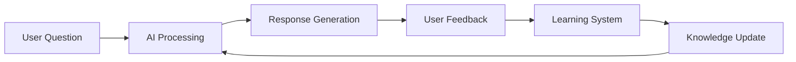

# 🏰 XYIAN Bot - Advanced AI-Powered Archero 2 Community Platform

<div align="center">


[](https://discord.com/api/oauth2/authorize?client_id=1424152001670938695&permissions=8&scope=bot%20applications.commands)
[](https://discord.gg/archero2)

**🧠 The most advanced AI-powered Discord bot for Archero 2 communities with machine learning, comprehensive analytics, and expert game knowledge!**

</div>

---

## 🚀 **Revolutionary Features**

### 🤖 **AI-Powered Intelligence**
- **OpenAI GPT-3.5-turbo Integration** - Context-aware responses with deep game knowledge
- **Machine Learning System** - Learns from user feedback and improves responses automatically
- **Expert Knowledge Database** - 800+ curated Q&A entries with advanced game mechanics
- **Channel-Aware AI** - Adapts responses based on channel type (general, guild, arena, bot-questions)

### 🧠 **Advanced Learning System**
- **Real-time Feedback Processing** - 👍/👎 reaction learning with confidence scoring
- **Pattern Recognition** - Automatic question categorization and topic identification
- **Similarity Matching** - Levenshtein distance algorithm for intelligent question matching
- **Auto-Correction** - Direct user corrections override and improve AI responses
- **Confidence Tracking** - Dynamic confidence scoring per question and response

### 📊 **Comprehensive Analytics Platform**
- **Self-Hosted Express.js API** - 9 endpoints for analytics, learning, and data export
- **Real-time Performance Monitoring** - Response times, AI vs database responses, user engagement
- **Learning Analytics** - Feedback analysis, question patterns, improvement suggestions
- **Data Export** - JSON/CSV export capabilities for advanced analysis
- **Rate Limiting & Security** - API key authentication and request limiting

---

## 🎮 **What is XYIAN Bot?**

XYIAN Bot is a **sophisticated AI-powered Discord platform** specifically designed for the **Archero 2** gaming community. It combines cutting-edge machine learning, comprehensive game knowledge, and advanced community management to create the ultimate gaming Discord experience.

### 🆕 **Latest Version: 0.1.1** - Major AI & ML Enhancements

- **🧠 Advanced Machine Learning** - Sophisticated learning system with pattern recognition
- **📊 Comprehensive Analytics** - Real-time performance monitoring and user engagement tracking
- **🤖 Enhanced AI Integration** - Role-based AI access with channel-specific responses
- **📈 Learning System** - Automatic response improvement from user feedback
- **🔧 API Server** - Self-hosted Express.js API with 9 endpoints for data access
- **📚 Expert Knowledge Database** - 800+ curated entries with advanced game mechanics

---

## 🏗️ **Sophisticated Architecture**

### **Dual-Service System**
```
┌─────────────────────────────────────────────────────────────┐
│                    XYIAN Bot Platform                      │
├─────────────────────────────────────────────────────────────┤
│  🤖 Discord Bot Service    │  📊 API Server Service        │
│  • AI-Powered Responses   │  • Analytics & Monitoring     │
│  • Machine Learning       │  • Data Export (JSON/CSV)      │
│  • Expert Knowledge DB    │  • Learning System API        │
│  • Real-time Feedback     │  • Performance Metrics        │
│  • Webhook Integration    │  • Rate Limiting & Security   │
└─────────────────────────────────────────────────────────────┘
```

### **Core Technologies**
- **Node.js** with **Discord.js v14** for Discord integration
- **TypeScript** for type safety and development
- **OpenAI GPT-3.5-turbo** for AI-powered responses
- **Express.js** API server with comprehensive endpoints
- **SQLite** with better-sqlite3 for analytics and learning
- **Winston** for comprehensive logging and monitoring

---

## 🎯 **Advanced Features**

### **🤖 AI-Powered Q&A System**
- **Context-Aware Responses** - AI adapts to channel type and user context
- **Expert Knowledge Integration** - 800+ curated entries with advanced game mechanics
- **Learning from Feedback** - Real-time improvement from user reactions
- **Confidence Scoring** - Dynamic confidence tracking for response quality
- **Fallback Systems** - Graceful degradation when AI is unavailable

### **🧠 Machine Learning Pipeline**


### **📊 Analytics & Monitoring**
- **Real-time Performance Tracking** - Response times, success rates, user engagement
- **Learning Analytics** - Feedback patterns, question frequency, improvement areas
- **User Behavior Analysis** - Popular questions, channel usage, engagement metrics
- **System Health Monitoring** - Uptime, error rates, performance bottlenecks

### **🔧 API Server Capabilities**
| Endpoint | Description | Authentication |
|----------|-------------|----------------|
| `/api/health` | System health check | Public |
| `/api/analytics/overview` | Performance metrics | API Key |
| `/api/learning/feedback` | Submit feedback | API Key |
| `/api/export/interactions` | Export data (JSON/CSV) | API Key |
| `/api/learning/suggestions` | Improvement suggestions | API Key |

---

## 🎮 **Archero 2 Game Integration**

### **🏆 Supreme Arena Mastery**
- **3-Character Team Compositions** - Optimal hero combinations with item bonuses
- **Build Optimization** - Different builds for each character with synergy analysis
- **Meta Analysis** - Current tier lists, counter-strategies, and competitive insights
- **Advanced Mechanics** - Resonance system, upgrade paths, and resource optimization

### **⚔️ Comprehensive Game Knowledge**
- **Weapon System** - Only 3 S-tier weapons (Oracle Staff, Griffin Claws, Dragoon Crossbow)
- **Character Database** - Legendary, Epic, and Common characters with detailed abilities
- **Upgrade System** - Epic → Legendary → Mythic → Chaotic progression paths
- **Event System** - Rotating events with correct status checking and optimization

### **🎯 Strategy Systems**
- **F2P Progression Guides** - Budget builds and resource optimization
- **PvP Strategies** - Arena and Supreme Arena competitive tactics
- **Guild Management** - XYIAN guild requirements and coordination
- **Event Optimization** - Timing, preparation, and reward maximization

---

## 🚀 **Quick Start**

### **Prerequisites**
- Node.js 16.9.0 or higher
- Discord Bot Token
- OpenAI API Key (optional, for AI features)
- Guild/Server Administrator permissions

### **Installation**

1. **Clone the repository**
   ```bash
   git clone https://github.com/yourusername/arch2-discord-bot.git
   cd arch2-discord-bot
   ```

2. **Install dependencies**
   ```bash
   npm install
   ```

3. **Configure environment**
   ```bash
   cp .env.example .env
   # Edit .env with your Discord token, OpenAI API key, and webhook URLs
   ```

4. **Start the platform**
   ```bash
   npm start
   ```

### **Environment Configuration**
```env
# Discord Configuration
DISCORD_TOKEN=your_discord_bot_token
CLIENT_ID=your_discord_client_id
GUILD_ID=your_discord_guild_id

# AI Configuration
OPENAI_API_KEY=your_openai_api_key

# Guild Configuration
ARCH_GUILD_ID=213797

# Webhook URLs
XYIAN_GUILD_WEBHOOK=your_xyian_webhook
GENERAL_CHAT_WEBHOOK=your_general_webhook
GUILD_RECRUIT_WEBHOOK=your_recruit_webhook
GUILD_EXPEDITION_WEBHOOK=your_expedition_webhook
GUILD_ARENA_WEBHOOK=your_arena_webhook

# API Configuration
API_PORT=3001
API_KEY=your_api_key
```

---

## 🎯 **Commands & Features**

### **🏰 Guild Commands** (XYIAN OFFICIAL role required)
| Command | Description | Example |
|---------|-------------|---------|
| `!xyian info` | Guild information and status | `!xyian info` |
| `!xyian members` | List guild members | `!xyian members` |
| `!xyian stats` | Guild statistics | `!xyian stats` |
| `!xyian weapon [name]` | Weapon information | `!xyian weapon oracle staff` |
| `!xyian skill [name]` | Skill analysis | `!xyian skill multi-shot` |
| `!xyian build [type]` | Build recommendations | `!xyian build pvp` |

### **🤖 AI-Powered Commands**
| Command | Description | Access Level |
|---------|-------------|--------------|
| `!help` | Complete command list | All users |
| `!ping` | Bot status and latency | All users |
| `!tip` | Daily Archero 2 tip | All users |
| `!analytics` | Performance metrics | XYIAN OFFICIAL |
| `!learn` | Learning system report | XYIAN OFFICIAL |

### **🧠 AI Q&A System**
- **Natural Language Processing** - Ask questions in natural language
- **Context-Aware Responses** - AI adapts to channel and user context
- **Expert Knowledge** - 800+ curated entries with advanced game mechanics
- **Learning from Feedback** - Real-time improvement from user reactions

---

## 📊 **Analytics & Learning**

### **Real-time Analytics**
- **Performance Metrics** - Response times, success rates, user engagement
- **Learning Analytics** - Feedback patterns, question frequency, improvement areas
- **User Behavior** - Popular questions, channel usage, engagement metrics
- **System Health** - Uptime, error rates, performance bottlenecks

### **Machine Learning Pipeline**
1. **Question Processing** - Natural language understanding and categorization
2. **AI Response Generation** - Context-aware response generation
3. **User Feedback Collection** - Real-time 👍/👎 reaction learning
4. **Learning System** - Pattern recognition and response improvement
5. **Knowledge Update** - Automatic database updates from learning

### **Learning System Features**
- **Confidence Scoring** - Dynamic confidence tracking per question
- **Similarity Matching** - Intelligent question matching with Levenshtein distance
- **Pattern Recognition** - Automatic topic categorization and analysis
- **Auto-Correction** - Direct user corrections override AI responses

---

## 🛠️ **Development & Architecture**

### **Project Structure**
```
arch2-discord-bot/
├── ultimate-xyian-bot.js          # Main bot service
├── api-server.js                  # Express API server
├── learning-system.js             # Machine learning system
├── archero2-data-scraper.js       # Data collection system
├── src/                           # TypeScript source
│   ├── commands/                  # Command handlers
│   ├── services/                  # Core services
│   ├── utils/                     # Utility functions
│   └── types/                     # TypeScript definitions
├── docs/                          # Comprehensive documentation
├── data/                          # Learning and analytics data
└── config/                        # Configuration files
```

### **Available Scripts**
```bash
npm run dev          # Development mode with hot reload
npm run build        # Build TypeScript to JavaScript
npm run start        # Start production platform
npm run lint         # Run ESLint
npm run deploy       # Deploy to hosting platform
npm run test         # Run test suite
```

### **API Endpoints**
```bash
# Health and Status
GET  /api/health                    # System health check
GET  /api/status                    # Real-time status

# Analytics
GET  /api/analytics/overview        # Performance metrics
GET  /api/analytics/questions/popular  # Popular questions
GET  /api/analytics/performance     # Response time analysis

# Learning System
POST /api/learning/feedback         # Submit feedback
GET  /api/learning/suggestions     # Improvement suggestions

# Data Export
GET  /api/export/interactions      # Export interactions (JSON/CSV)
GET  /api/export/analytics         # Export analytics (JSON/CSV)
```

---

## 📈 **Performance & Monitoring**

### **System Metrics**
- **Response Time Tracking** - Average, minimum, maximum response times
- **AI vs Database Responses** - Performance comparison and optimization
- **User Engagement** - Question frequency, channel usage, feedback patterns
- **Learning Progress** - Confidence scores, improvement trends, knowledge growth

### **Health Monitoring**
- **Uptime Tracking** - System availability and reliability
- **Error Monitoring** - Error rates, failure patterns, system stability
- **Performance Bottlenecks** - Identification and optimization of slow areas
- **Resource Usage** - Memory, CPU, and database performance

---

## 🌟 **Community & Support**

### **Join the XYIAN Guild**
- **Guild ID**: `213797`
- **Requirements**: 300k+ power, daily active
- **Benefits**: Expert strategies, active community, event coordination
- **AI Access**: Enhanced AI features for guild members

### **Support & Feedback**
- **XYIAN Discord Server**: [Join our community](https://discord.gg/archero2)
- **Official Archero 2 Discord**: [Join the official server](https://discord.com/invite/archero2) - 175,000+ members, 19,500+ online
- **Issues**: [Report bugs or request features](https://github.com/yourusername/arch2-discord-bot/issues)
- **Discussions**: [Community discussions](https://github.com/yourusername/arch2-discord-bot/discussions)

---

## 📚 **Documentation**

- **[Bot Architecture](docs/BOT-ARCHITECTURE.md)** - Complete system architecture
- **[AI Integration Guide](docs/AI-INTEGRATION-GUIDE.md)** - AI system documentation
- **[Learning System](docs/LEARNING-AND-ANALYTICS-ROADMAP.md)** - ML system guide
- **[Archero 2 Mechanics](docs/ARCHERO2-GAME-MECHANICS.md)** - Game knowledge database
- **[Deployment Guide](docs/DEPLOYMENT-GUIDE.md)** - Hosting and deployment
- **[API Reference](docs/discord-api.md)** - Complete API documentation

---

## 🏆 **Achievements & Stats**

### **Platform Statistics**
- **800+ Q&A Entries** - Comprehensive game knowledge database
- **9 API Endpoints** - Complete analytics and learning platform
- **Real-time Learning** - Machine learning from user feedback
- **Multi-channel AI** - Context-aware responses across channels
- **Advanced Analytics** - Comprehensive performance monitoring

### **Technical Achievements**
- **Dual-Service Architecture** - Discord bot + API server on single instance
- **Machine Learning Pipeline** - Real-time learning and improvement
- **Expert Knowledge Integration** - Curated game mechanics database
- **Advanced Analytics** - Performance monitoring and user behavior analysis

---

## 📄 **License**

This project is licensed under the MIT License - see the [LICENSE](LICENSE) file for details.

---

## 🙏 **Acknowledgments**

- **Archero 2 Community** - For game insights and strategy sharing
- **Discord.js** - For the amazing Discord API library
- **OpenAI** - For powerful AI capabilities
- **XYIAN Guild Members** - For testing, feedback, and community support
- **Archero 2 Developers** - For creating an amazing game

---

<div align="center">

**🧠 Made with AI, Machine Learning, and ❤️ for the Archero 2 Community**

[](https://github.com/yourusername/arch2-discord-bot)
[](https://discord.gg/archero2)
[](docs/discord-api.md)

</div>